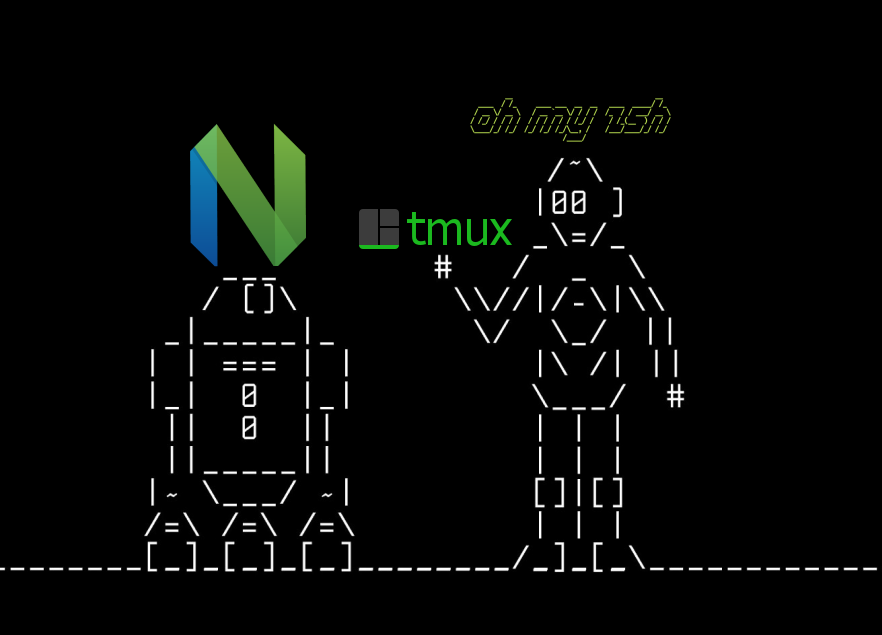

<div id="top"></div>
<!-- PROJECT SHIELDS -->
<!--
*** I'm using markdown "reference style" links for readability.
*** Reference links are enclosed in brackets [ ] instead of parentheses ( ).
*** See the bottom of this document for the declaration of the reference variables
*** for contributors-url, forks-url, etc. This is an optional, concise syntax you may use.
*** https://www.markdownguide.org/basic-syntax/#reference-style-links
-->

[![MIT License][license-shield]][license-url]

<!-- PROJECT LOGO -->
<br />
<div align="center">
  <a href="https://github.com/Oceanbao/dots">
    
  </a>

<h3 align="center">Ocean Shell</h3>

  <p align="center">
    Setup code for Shell on Linux OS.
    <br />
    <a href="https://github.com/Oceanbao/dots"><strong>Explore the docs »</strong></a>
    <br />
    <br />
    <a href="https://github.com/Oceanbao/dots">View Demo</a>
    ·
    <a href="https://github.com/Oceanbao/dots/issues">Report Bug</a>
    ·
    <a href="https://github.com/Oceanbao/dots/issues">Request Feature</a>
  </p>
</div>

<!-- TABLE OF CONTENTS -->
<details>
  <summary>Table of Contents</summary>
  <ol>
    <li>
      <a href="#about-the-project">About The Project</a>
      <ul>
        <li><a href="#built-with">Built With</a></li>
      </ul>
    </li>
    <li>
      <a href="#getting-started">Getting Started</a>
      <ul>
        <li><a href="#prerequisites">Prerequisites</a></li>
        <li><a href="#installation">Installation</a></li>
      </ul>
    </li>
    <li><a href="#usage">Usage</a></li>
    <li><a href="#roadmap">Roadmap</a></li>
    <li><a href="#contributing">Contributing</a></li>
    <li><a href="#license">License</a></li>
    <li><a href="#contact">Contact</a></li>
    <li><a href="#acknowledgments">Acknowledgments</a></li>
  </ol>
</details>

<!-- ABOUT THE PROJECT -->

## About The Project

[![Product Name Screen Shot][product-screenshot]](https://example.com)

Shell environment setup.

<p align="right">(<a href="#top">back to top</a>)</p>

### Built With

- [Zsh](https://zsh.org)
- [Oh-My-Zsh](https://ohmyz.sh)
- [Neovim](https://neovim.io)
  - and plugins
- [Tmux](https://github.com/tmux/tmux)

<p align="right">(<a href="#top">back to top</a>)</p>

<!-- GETTING STARTED -->

## Getting Started

The following shows how to use this shell setup.

### Prerequisites

- The repo only works on Linux (Ubuntu/Debian and Arch)
- Root access is required (TODO: how to circumvent this)

### Installation

1. As `root` user download this repo somewhere - e.g. `/tmp`
   ```bash
   (root): git clone https://github.com/Oceanbao/dots.git
   ```
2. Step1: create new user (or existing user) and install basic libs
   ```sh
   (root): bash dots/main.sh init
   ```
   - Follow the instruction to create/use `USER`
3. Step2: install Linuxbrew via `USER` shell (this is required by Linuxbrew)
   ```sh
   (USER): git clone https://github.com/Oceanbao/dots.git
   (USER): bash dots/main.sh brew
   ```
4. Step3: as `root` install all dotfiles (see TODO: for detail)
   ```sh
   (root): bash dots/main.sh dotup
   ```
5. Step4: as `USER` install post-setups (see TODO: for detail)
   ```sh
   (USER): bash dots/main.sh post
   ```
6. Step5: setup for zsh theme and neovim
  ```sh
  # Go to USER shell
  (root): su - $USER
  # This will prompt powerline13k setup
  # Then setup vim by enter vim
  # Run the following in vim's cmd
  :PluginInstall
  # Exit and re-enter vim to wait for treesitter setup
  # Setup defx
  :remotePluginInstall
  TODO:
  ```

<p align="right">(<a href="#top">back to top</a>)</p>

<!-- USAGE EXAMPLES -->

## Usage

Once the **Installation** is successful, `USER` shell will have:

- Tmux + Lualine combo

[![Shell Screen Shot][shell-screenshot]](images/shell.jpg)

- Neovim with defx

[![Defx Screen Shot][defx-screenshot]](images/defx.jpg)

- Neovim with Completion

[![Completion Screen Shot][completion-screenshot]](images/completion.jpg)

- Neovim with Telescope

[![Telescope Screen Shot][telescope-screenshot]](images/telescope.jpg)

<!-- _For more examples, please refer to the [Documentation](https://example.com)_ -->

<p align="right">(<a href="#top">back to top</a>)</p>

<!-- ROADMAP -->

## Roadmap

- [ ] Streamline installation without `root` access
- [ ] Streamline installation by single step
- [ ] Support more platforms

See the [open issues](https://github.com/Oceanbao/dots/issues) for a full list of proposed features (and known issues).

<p align="right">(<a href="#top">back to top</a>)</p>

<!-- CONTRIBUTING -->

## Contributing

TODO:

Contributions are what make the open source community such an amazing place to learn, inspire, and create. Any contributions you make are **greatly appreciated**.

If you have a suggestion that would make this better, please fork the repo and create a pull request. You can also simply open an issue with the tag "enhancement".
Don't forget to give the project a star! Thanks again!

1. Fork the Project
2. Create your Feature Branch (`git checkout -b feature/AmazingFeature`)
3. Commit your Changes (`git commit -m 'Add some AmazingFeature'`)
4. Push to the Branch (`git push origin feature/AmazingFeature`)
5. Open a Pull Request

<p align="right">(<a href="#top">back to top</a>)</p>

<!-- LICENSE -->

## License

Distributed under the MIT License. See `LICENSE.txt` for more information.

<p align="right">(<a href="#top">back to top</a>)</p>

<!-- CONTACT -->

## Contact

Ocean Bao - [@oceanbao](https://twitter.com/oceanbao) - baobaobiz@gmail.com

<p align="right">(<a href="#top">back to top</a>)</p>

<!-- ACKNOWLEDGMENTS -->

## Acknowledgments

- Heavily inspired by [craftzdog's dotfiles](https://github.com/craftzdog/dotfiles-public)

<p align="right">(<a href="#top">back to top</a>)</p>

<!-- MARKDOWN LINKS & IMAGES -->
<!-- https://www.markdownguide.org/basic-syntax/#reference-style-links -->

[license-shield]:https://img.shields.io/github/license/oceanbao/dots.svg?style=for-the-badge 
[license-url]: https://github.com/Oceanbao/dots/blob/master/LICENSE.txt
[product-screenshot]: images/product.jpg
[shell-screenshot]: images/shell.jpg
[defx-screenshot]: images/defx.jpg
[completion-screenshot]: images/completion.jpg
[telescope-screenshot]: images/telescope.jpg
